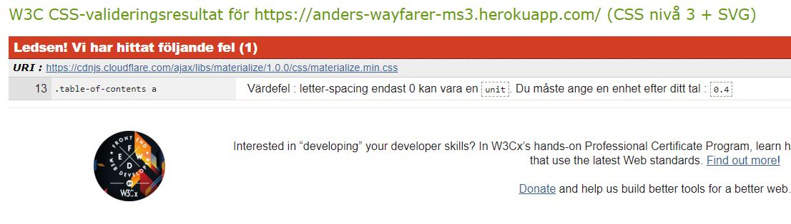

# Anders Fält- Milestone Project 3
## Wayfarer

[Visit my live website here!](https://anders-wayfarer-ms3.herokuapp.com/)

# Table Of Contents

1. [Description](#description)
2. [UX](#ux)
    - [Target Audience](#target-audience)
    - [User Stories](#user-stories)
3. [Design](#design)
    - [Wireframes](#wireframes)
    - [Colors](#colors)
    - [Database](#database)
4. [Features](#features)
    - [Current Features](#current-features)
    - [Future Features](#future-features)
5. [Technologies Used](#technologies-used)
6. [Testing](#testing)
7. [Deployment](#deployment)
8. [Credits](#credits)

# Description

Wayfarer is a website finding great places to visit. It allows users to search, create accounts, add some of their own favourite places

# UX

## Target Audience

The target audience for my site are people who enjoy traveling and also like to share their favourite places and explore other peoples suggestions. 

## User Stories

### First Time and Returning Users

All users of this site will be looking for similar things, outlined below;
-	Easy and clear navigation throughout the entire site on all device types.
-	To be able to view/preview the site before registering an account.
-	Have clear Registration/Log In pages.
-	Have the ability to add their own favourite places.
-	To be able to edit and delete the places they add.
-	Search the site to find great places to visit.
-	To be provided with social links.
-	Once finished, to securely log out of the site.

### Site Owner/Admin

-	For users to have easy access to all areas of the site.
-	For the site to be clear and concistant.
-	To be able to add, edit and delete places added by users.

# Design

## Wireframes

To create the wireframes, I used Adobe XD.

-	
-	

## Colors

For the colour scheme for my site, I used the Materialize colour chart. I went with a dark cyan and orange theme
Here is a list of colours used for my site;
-	orange darken-3
-	cyan darken-4

## Database

I used MongoDB as the database for this project. The database have two collections
-	Users
-	Places
### Users

Storing users usernames and passwords allows users to register and log in/log out securely. 

### Places

When a user adds a place to the site, the information will be stored in the database. The information is stored securely, and can be easily displayed on the site.

# Features

## Current Features

### Features

-	Responsiveness – The site is fully responsive to all screen sizes. 
-	Navbar and footer – The navbar and footer will be the same throughout the entire site, with the same links and information across all pages.
-	Flash messages – Flash messages are there to provide the user with feedback once registered, logged in, logged out etc. 
-	Each page has a header that easily shows the user the page they are on.

### Add/Edit/Delete Places

-	The places can easily be edited or deleted by logged in users 
-	Logged in users can easilly add new places 
-	When deleting a place the site has a built in redundancy to prevent users accidentally deleting a place. 

## Future Features

These are some features I would like to implement in the future;

-	Comments - I would like to add a feature whereby users can comment on an existing review.
-	Separate Pages – I think it would be good to have separate paces for each place in order to be able to give more information on each place.
-   Pagination - I would like to limit the number of places per page, thus giving the site a cleaner look.

# Technologies Used

## Frameworks Libraries and Programmes

 - [**HTML5**](https://en.wikipedia.org/wiki/HTML5) –  to create the websites main structures
 - [**CSS3**](https://en.wikipedia.org/wiki/CSS) – to style the components created with HTML
 - [**Python**](https://www.python.org/download/releases/3.0/)
 - [**Materialize**](https://materializecss.com/) – to create responsive elements on the page.
 - [**FontAwesome**](https://fontawesome.com/)  - icons used throughout the site.
 - [**Google Fonts**](https://fonts.google.com/) – Imported fonts.
 - [**GitPod**](https://gitpod.io/) – IDE used for coding
 - [**GitHub**](https://github.com/) – Used for hosting the files used for the website.
 - [**Git**](https://git-scm.com/) – Version control used to track changes, commit and push code to
   Github.
 - [**Javascript**](https://www.javascript.com/)
 - [**Flask**](https://flask.palletsprojects.com/en/2.0.x/)
 - [**Lightspeed**](https://developers.google.com/speed/pagespeed/insights/) - Website performance testing utility
 - [**DevTools**](https://developers.google.com/web/tools/chrome-devtools) - I used Chrome DevTools throughout the development of the site
 - [**W3 HTML Validation**](https://validator.w3.org/) - Online HTML validation tool. 
 - [**W3 CSS Validation**](https://jigsaw.w3.org/css-validator/) - Online CSS validation tool.
 - [**PEP8 Check**](http://pep8online.com/checkresult) - Online PEP8 Checker.
 - **Gitpod extensions:**
     - Bracket Pair Colorizer
     - Prettier - Code Formatter
     - Indent-Rainbow
 - [**Techsini**](http://techsini.com/multi-mockup/index.php) - I used this website to create a multi mockup of the live website display at the head of my Readme file. 
# Testing

1. All links on the website connect to the correct location.
2. All images and elements on website loads correctly.
3. All elements on the website are responsive.
4. All external links work and goes to the correct website.
6. The website loads correctly and functions on Chrome, Safari and Firefox browsers.
7. The website performs as required as outlined in User Stories for external users and the site owner.

This warning needs to fixed

I did not know how to fix this error

# Deployment
## GitHub Pages

This site was created and managed using GitHub and GitPod. Outlined below is how this site was deployed.

-	Log into GitHub.
-	Go to the repository list and select the project you are looking to deploy.
-	Below the repository name is a menu. Select settings.
-	Scroll down to the “GitHub Pages” section of the page.
-	Under the subheading “Source”, select the branch you wish to deploy.
-	The page will refresh. Scroll down to the “GitHub Pages” section again and just below the heading, there will be a tick, with the line “Your site is published at…” and the URL.
-	Copy the URL and paste it into a new tab/window to view the live site.

## Forking The Repository

Forking the repository allows you to make a copy of the original, and make changes without amending the original. 

-	Log into GitHub.
-	Select the repository you are looking for.
-	At the top of the repository, in line with the repository name and on the right hand side, will be a “Fork” button. Select this and it will fork the repository for you.
-	You will then have a copy of the original repository in your GitHub account repository list.

## Cloning The Repository

You can run your own version by cloning the repository. To make a local clone, follow the steps below.

-	Log into GitHub.
-	Locate the repository for the site you are wishing to clone.
-	On the left of the green “GitPod” button will be a dropdown menu that says “Code”.
-	Select it and copy the URL under the “HTTPS” tab.
-	Open your preferred terminal. 
-	Type “git clone” and paste the copied URL.
-	Press Enter, and the code will be cloned. 

## Heroku

This project is deployed using Heroku. The following steps were taken;

1.	Within GitPod, create the .gitignore and env.py files.
2.	In the .gitignore file, set it to ignore the env.py file and pycache/ directory.
3.	Within the env.py file, set the following environmental variable;
    - os.environ.setdefault(“IP”, “0.0.0.0”)
    - os.environ.setdefault(“PORT”, “5000”)
    - os.environ.setdefault(“SECRET_KEY”, “YOUR_SECRET_KEY”)
    - os.environ.setdefault(“MONGO_URI”, “mongo db link to go here”)
    - os.environ.setdefault(“MONGO_DBNAME”, “YOUR_DATABASE_NAME”)
4.	Make sure that the env.py file has been saved correctly and open the app.py file. Import OS, Flask and the env.py file.
5.	Create a requirements.txt file by typing in the terminal; pip3 freeze –local > requirements.txt.
6.	For Heroku, you will also need a Procfile. Create this by using the terminal and typing; echo web: python app.py > Procfile. Access the Procfile and delete the bottom empty line to avoid any issues in the future.
7.	Go to the Heroku site, and log in or create a profile. From the dashboard, select “New App”. Create a name for your app, select the correct region and click “Create App”.
8.	Navigate over to the “Deploy” tab and go to the “Deployment method” section. Click on GitHub.
9.	Search for your repository name, and click “Connect” next to your repository name.
10.	Next, go to the “Settings” tab, and scroll down to “Config Vars”. Click “Reveal config vars”.
11.	Enter the Key and Value pairs as per your env.py file;
    - IP : 0.0.0.0
    - PORT : 5000
    - SECRET_KEY : YOUR_SECRET_KEY
    - MONGO_URI : “mongo db link to go here”
    - MONGO_DBNAME : “your database name”
12.	Finally, go back to the “Deploy” tab, and scroll down to “Automatic deploys”. Click on “Enable Automatic Deploys” then “Deploy Branch”. 
13.	The app will now be built and upon completion, you will receive a message saying “Your app was successfully deployed”. 
14. You can now click on “Open App” which will launch the deployed app.

# Credits

## Code

I used the Code Institute walkthrough project Task Manager as a guide for my project. I adjusted the code and added my own to create my site.
For the styling of the site I used Materialize classes. 

## Media

### Main Content

The images for the main content is submittet via image URL therefore the images will come from different sources

### Text

The text used for the places added to the site was taken from https://theculturetrip.com/asia/thailand/articles/the-15-best-destinations-in-thailand/

## Acknowledgements

-	I would like to thank my mentor, Gerard Mcbride, for his guidance . 
-	The slack community for helping me with my coding problems